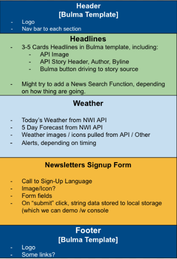
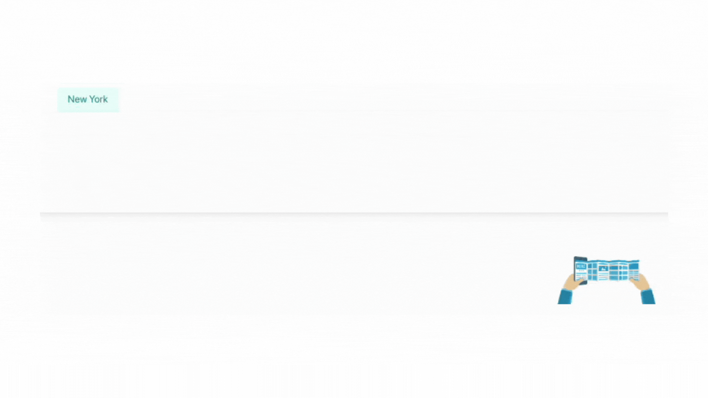
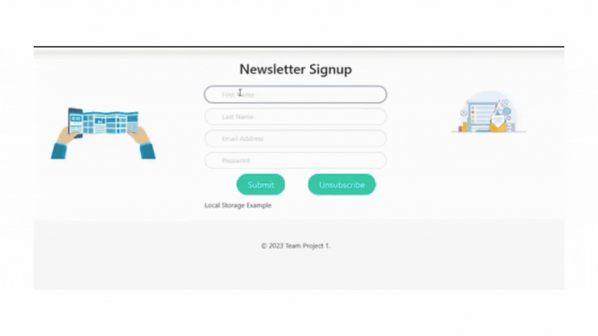
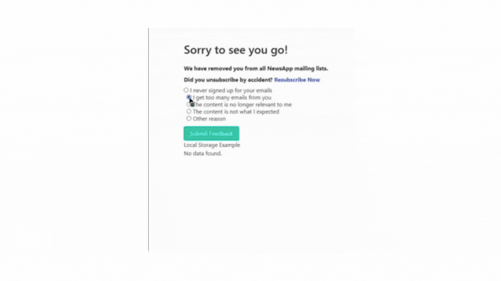

# Group Project 1: News + Weather App
### Team Members: Garrett Swink, Jasmin Flores, Kyle Ann

## Objective
Create a sleek and straightforward news app, providing users with headlines, weather forecasts, and an opportunity to sign-up for a newsletter.

## Audience
Casual news consumers looking for today's top headlines and local weather.

## User Story
As a news reader, I want a resource for headlines and weather.
As a news reader, I want filter options for headline topics and local weather.
As a news reader, I want to sign up for a newsletter, so that more top stories are delivered to my inbox. 

## Acceptance Criteria
WHEN I open the website
THEN nav bar will provide one click access to each section of the website

WHEN I open the website
THEN the top headlines of the day are displayed in four tiles, including story headline, image, author, publication, and description

WHEN I click a headline topic filter button
THEN the news tiles repopulate with that topics four top stories stories

WHEN I open the website
THEN today's forecast and a four day forecast projection will display on the screen.

WHEN a location tab is clicked on the weather section
THEN the day's forecast and four day projection will update

WHEN a user clicks the subsribe button in the top right corner of the head header
THEN a user will be taken to the sign-up form

WHEN a user enters their personal data into the sign-up form
THEN the user data will will be save to local memory, and can be displayed with concole.log

# Assets

## APIs 
In assembling this project we used two free, open access API's.

    - News API: https://newsapi.org/
    
    - National Weather Service API: https://www.weather.gov/documentation/services-web-api

## CSS Framework + Style 
    - For styling and layout, we utilized Bulma (bulma.io) for elements, components, and forms. We utilized Bulma columns throughout the site to provide dynamic layout.   

    - Additional icon and banner png and gif files were created using Canva.com

# Planning and Wireframe

The team divided the project by website section (headlines, weather, newsletter), and segmented the site into flexible, Bulma containers of 100% width to help assure our respective work did not crowd into or create errors in other sections.

## Functionality Demos

### Headlines

### Weather Display

### Form Inputs

### Live Link 
